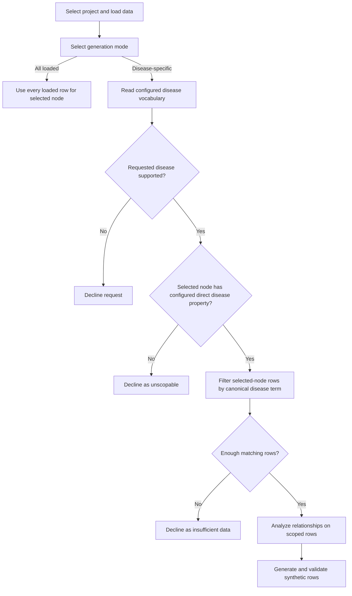

# Disease-Specific Generation Guide

## Purpose

This guide explains what changed in the synthetic data generator, why the change was needed, how the implementation works, how to use it in the UI, and how another project can configure the same behavior.

## What changed

Before this change, node generation always used every loaded row for the selected node:

```text
selected node -> all loaded rows -> relationship analysis -> synthetic generation
```

The application did not ask for a disease, validate a disease vocabulary, or prove that the selected rows belonged to a disease. A file containing only Glioma records could make the output appear Glioma-specific, but the application did not enforce that meaning.

Generation now has two explicit modes:

| Mode | Source rows | Meaning of output |
| --- | --- | --- |
| Project-derived disease-specific | Only rows directly verified for the selected disease | May be described as disease-specific |
| All loaded source data | Every loaded row for the selected node | Must not be described as disease-specific |

The change also added:

- a per-project disease-generation configuration registry;
- dynamic disease vocabulary extraction from loaded data;
- conservative disease-name normalization and matching;
- minimum source-row requirements;
- clear unsupported, insufficient-data, and unscopable-node outcomes;
- the same row scoping for property analysis and synthetic generation;
- isolation between projects, so an unconfigured project cannot inherit ICDC rules; and
- regression handling for optional feature analyzers that have no weight profile for a node.

## Why the change was needed

The generator learns property values and relationships from existing rows. If those rows are not proven to belong to the requested disease, the system could produce general data and incorrectly label it disease-specific.

For example, this request is unsafe without a verified linkage:

```text
Selected node: case
Requested disease: Glioma
```

An ICDC `case` row contains properties such as `case_id` and `patient_id`, but it does not contain `disease_term`. Using every loaded case row would silently assume that every case belongs to Glioma.

The implementation therefore fails closed:

- it never silently falls back from disease-specific mode to all-loaded mode;
- it declines unsupported diseases;
- it declines nodes that cannot be reliably associated with the disease; and
- it declines small disease-specific row sets that are below the configured threshold.

This protects the meaning of the generated output. Users can still select all-loaded mode explicitly when they want the previous behavior without a disease-specific claim.

## How it works

### Request flow



### Project selection

The selected project is passed through the UI to analysis and generation. The application looks up that project in `DISEASE_GENERATION_CONFIGS`.

- A configured project receives its project-specific disease mode.
- An unconfigured project can use only `All loaded source data`.
- Project names are looked up case-insensitively.
- A project never falls back to another project's disease configuration.

### Vocabulary extraction

Each project profile identifies an authoritative vocabulary node and property. ICDC currently uses:

```text
diagnosis.disease_term
```

Supported terms are extracted from the currently loaded vocabulary rows. The implementation:

- trims leading and trailing whitespace;
- collapses repeated whitespace;
- compares terms case-insensitively;
- preserves a deterministic display spelling; and
- removes configured missing-value terms such as `Unknown`, `Not Reported`, and blank values.

Matching is intentionally conservative. It does not silently use fuzzy matching or infer aliases. For example, `glioma` resolves to `Glioma`, but an unrelated or misspelled term is not automatically mapped.

### Direct row scoping

The current implementation supports disease scoping when the selected node contains a configured disease property.

For ICDC `diagnosis`:

```text
requested disease: Glioma
scope property: diagnosis.disease_term
result: only diagnosis rows whose disease_term is Glioma
```

Only the scoped rows are passed to `PairwiseRelationshipEvaluator` and `SyntheticDataGenerator`. This is important because filtering after analysis would allow relationships from other diseases to influence the generated output.

### Minimum row threshold

After filtering, the selected node must contain at least the configured number of verified rows. ICDC defaults to five rows.

The threshold can be changed when the application starts:

```bash
MIN_DISEASE_NODE_ROWS=10 .venv/bin/python app.py
```

If fewer rows remain, the request is declined before relationship analysis or generation.

### Request outcomes

| Outcome | Meaning | Does generation run? |
| --- | --- | --- |
| Supported | The disease exists, the node is directly scoppable, and enough rows remain | Yes |
| Unsupported disease | The requested term is absent from the loaded project vocabulary | No |
| Insufficient node data | No rows or fewer than the configured minimum remain | No |
| Unscopable node | The disease exists, but the selected node lacks a reliable configured disease property | No |
| All loaded | The user explicitly selected all-loaded mode | Yes, without a disease-specific claim |
| Invalid request | Required selections or valid project configuration are missing | No |

## How to use it in the UI

### Start or restart the application

Stop an existing process with `Ctrl+C`, then run:

```bash
.venv/bin/python app.py
```

Refresh the browser after restarting. A running Python process does not reliably load source-code changes automatically.

### Generate ICDC disease-specific diagnosis data

1. Select `ICDC` as the project.
2. Load the project schema.
3. Upload the source records, such as `data_files/GLIOMA01-records.json`.
4. Select the `diagnosis` node.
5. Select `ICDC-derived disease-specific` as the generation mode.
6. Select or enter `Glioma`.
7. Enter the number of synthetic rows to generate.
8. Click `Analyze and Generate Synthetic Data`.
9. Confirm that the status reports the canonical disease and verified source-row count.
10. Review the relationship-analysis, valid generated-data, and invalid-data tables.

With the current Glioma fixture, the application finds 81 verified `diagnosis` rows.

### Generate without a disease-specific claim

To retain the original whole-dataset behavior:

1. Select a node.
2. Select `All loaded source data`.
3. Generate the requested rows.

The status explicitly states that the output should not be treated as disease-specific.

### Understand an unscopable-node message

The following message is expected when selecting ICDC `case` with `Glioma`:

```text
"Glioma" exists in the ICDC disease vocabulary, but the loaded "case"
rows cannot be reliably associated with that disease.
```

It means:

- `Glioma` is present in `diagnosis.disease_term`;
- loaded `case` rows exist; but
- `case` has no configured direct disease property.

Choose one of these actions:

- select `diagnosis` for current disease-specific generation;
- select `All loaded source data` for general `case` generation; or
- implement and configure relationship-based scoping before claiming that generated cases are Glioma-specific.

## Configure another project

### Required data contract

Before adding a profile, confirm all of the following:

1. The project has an authoritative node/property containing disease terms.
2. Uploaded data includes that vocabulary node and property.
3. Every node enabled for direct disease scoping contains a reliable disease property.
4. The property's values use the same canonical vocabulary, or a separately approved mapping exists.
5. The project has an agreed minimum number of source rows.
6. Missing-value terms are known.

Do not configure a node merely because its uploaded file is named for a disease. The relationship must be represented in the row data or resolved through an implemented linkage path.

### Add the model configuration

If this is an entirely new project, add its schema URLs to `projects_config` in `config.py`:

```python
projects_config["NEW_PROJECT"] = {
    "NODE_MODEL_URL": "https://example.org/new-project-model.yml",
    "PROP_MODEL_URL": "https://example.org/new-project-model-props.yml",
}
```

Existing projects such as CDS, CTDC, and GC already have model configuration but do not yet have validated disease-generation profiles.

### Add the disease-generation profile

Register a `DiseaseGenerationConfig` in `DISEASE_GENERATION_CONFIGS`:

```python
"NEW_PROJECT": DiseaseGenerationConfig(
    project_key="NEW_PROJECT",
    source_label="New Project",
    vocabulary_node="condition",
    vocabulary_property="condition_name",
    direct_scope_properties={
        "condition": "condition_name",
        "sample": "condition_label",
    },
    minimum_node_rows=5,
    missing_terms=frozenset({
        "",
        "unknown",
        "not reported",
        "not applicable",
    }),
    request_label="Condition",
),
```

| Field | Purpose |
| --- | --- |
| `project_key` | Stable project identifier matching the UI project key |
| `source_label` | Project name used in mode labels and status messages |
| `vocabulary_node` | Node containing authoritative disease terms |
| `vocabulary_property` | Property containing those disease terms |
| `direct_scope_properties` | Mapping from selectable node to its direct disease property |
| `minimum_node_rows` | Minimum verified rows required before generation |
| `missing_terms` | Values excluded from the supported vocabulary |
| `request_label` | Label shown on the disease selector |

Prefer explicit mappings for each supported node. A `"*"` mapping is appropriate only when every intended node truly uses the same disease property.

### Relationship-based scoping is not implemented yet

Some nodes do not carry a disease property and must be associated through other nodes. For the current ICDC Glioma fixture, the data suggests this direct identifier match:

```text
case.case_id -> diagnosis.diagnosis_id -> diagnosis.disease_term
```

All 81 case identifiers match 81 unique diagnosis identifiers in that fixture. That observation is not yet a configurable or executed join in the application.

Supporting it safely requires two additions:

1. A generic relationship-scoping engine that can execute configured joins or graph paths, validate required nodes and properties, handle cardinality, and reject incomplete or ambiguous matches.
2. Project-specific linkage configuration describing the approved path for each selectable node.

A possible future configuration shape is:

```python
relationship_paths={
    "case": [
        LinkStep(
            from_node="case",
            from_property="case_id",
            to_node="diagnosis",
            to_property="diagnosis_id",
        )
    ]
}
```

This example documents the intended direction only; `LinkStep` and `relationship_paths` are not part of the current implementation.

## Testing

### Automated tests

Run the complete suite:

```bash
.venv/bin/python -m unittest discover -s tests -v
```

The tests cover:

- conservative vocabulary normalization;
- missing-value exclusion;
- supported and unsupported diseases;
- exact and insufficient row thresholds;
- direct scoping for differently named project fields;
- unscopable nodes;
- explicit all-loaded behavior;
- project isolation;
- UI control state changes;
- generator short-circuit behavior; and
- nodes with no optional substring-weight profile.

### Manual UI test matrix

| Project | Node | Mode | Disease | Expected result |
| --- | --- | --- | --- | --- |
| ICDC | diagnosis | ICDC-derived disease-specific | Glioma | Generate from 81 verified fixture rows |
| ICDC | diagnosis | ICDC-derived disease-specific | Unsupported term | Decline and list supported terms |
| ICDC | case | ICDC-derived disease-specific | Glioma | Decline because direct linkage is unavailable |
| ICDC | case | All loaded source data | None | Generate from all loaded case rows with disclaimer |
| Unconfigured project | Any loaded node | All loaded source data | None | Generate without disease-specific claim |
| Unconfigured project | Any node | Project-derived disease-specific | Any | Mode unavailable or request rejected |

### Integration check

Automated callback tests mock the relationship evaluator so they can verify request validation and row scoping in isolation. When changing feature weights, schema parsing, or relationship evaluation, also run a real UI generation or an equivalent callback using an actual project schema and uploaded records.

This integration check caught a pre-existing edge case: `diagnosis` had no substring-weight profile, and the substring analyzer treated an empty profile as usable. It now skips that optional feature when no profile is available, allowing the remaining configured analyzers to continue.

## Implementation map

| File | Responsibility |
| --- | --- |
| `config.py` | Project registry and `DiseaseGenerationConfig` definitions |
| `disease_vocabulary.py` | Vocabulary extraction, normalization, request validation, and row scoping |
| `render/configuration_view.py` | Selected-project state |
| `render/intra_analysis_view.py` | Generation mode, disease controls, status, and callback wiring |
| `analyze/intra_node.py` | Runs property analysis on the validated scoped rows |
| `generate/intra_node.py` | Runs relationship analysis and generation only after scope validation |
| `feature/substring.py` | Skips optional substring analysis when a node has no weight profile |
| `tests/` | Unit, callback, UI-state, project-isolation, and regression coverage |

## Current boundaries

The current implementation intentionally does not provide:

- fuzzy disease matching;
- automatic alias resolution;
- relationship-based or multi-hop row traversal;
- Neo4j-backed vocabulary and row scoping;
- manual user-provided value-list generation; or
- an automatic generic fallback for unsupported diseases.

These boundaries ensure that output is labeled disease-specific only when the loaded rows directly prove that scope.
