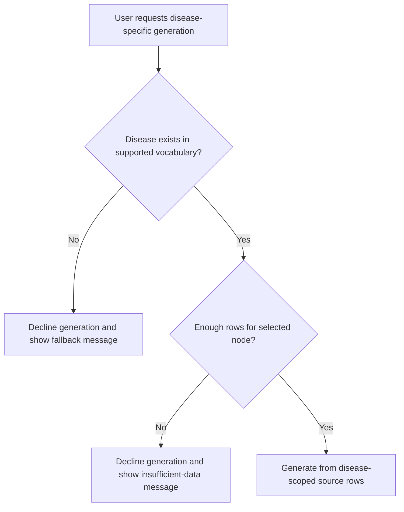
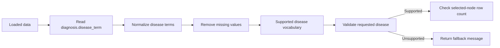
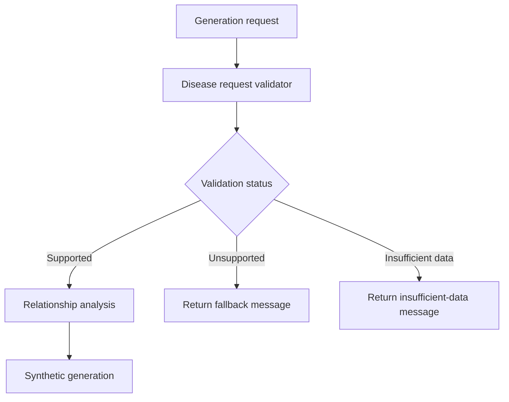

# Unsupported Disease Generation Fallback Strategy

## Summary

This document defines the fallback behavior for unsupported disease-specific synthetic data generation.

The generator should only create disease-specific examples when the requested disease exists in validated ICDC source data and has enough source rows for the selected node. If the disease is unsupported, the generator should decline the request and return a clear message.

No generic/default fallback should be used.

## Problem

The generator learns values and relationships from existing validated ICDC data. If a disease does not exist in that data, the system cannot safely generate disease-specific examples for it.

Generating anyway could make unrelated or generic values appear disease-specific.

## Decision

Use Option B: decline unsupported disease-specific generation.

The system should:

- Check the requested disease against supported ICDC disease terms.
- Derive supported terms from `diagnosis.disease_term`.
- Exclude blank and missing-value terms such as `Unknown`, `Not Reported`, and `Not Applicable`.
- Generate only when the disease is supported and enough rows exist for the selected node.
- Return a clear fallback message when generation cannot proceed.

The system should not:

- Silently fall back to all loaded data.
- Generate a generic/default dataset.
- Claim output is disease-specific unless it was generated from disease-scoped source rows.

## Behavior Flow



## Supported Disease Definition

A disease is supported when:

- It appears in validated source data as `diagnosis.disease_term`.
- The value is not blank or a missing-value sentinel.
- Disease-associated rows are available for the selected node.
- The row count is sufficient to learn reliable relationships.

Missing-value terms should be excluded, including:

- empty string
- `Unknown`
- `Not Reported`
- `Not Applicable`
- `NA`
- `N/A`
- `None`
- `Null`
- `NaN`

## Request Validation Flow



## Fallback Messages

### Unsupported Disease

```text
ICDC does not currently have validated source data for "<requested disease>", so this tool cannot generate disease-specific example files for that disease.

Supported ICDC-derived disease terms are: <supported terms>.

To proceed, choose a supported disease term or submit validated study data first so the ICDC vocabulary can be updated.
```

### Supported Disease With Insufficient Node Data

```text
"<requested disease>" exists in the ICDC disease vocabulary, but there are not enough validated "<selected node>" rows associated with that disease to generate reliable examples.

Available node support for this disease: <node counts>.
```

### No Disease Requested

```text
No disease was requested. The generator will use all loaded source data. The output should not be treated as disease-specific.
```

## Technical Recommendation

Add a small disease vocabulary/request validation layer before relationship analysis and synthetic generation.



The validator should return a reusable result object with:

- validation status
- requested disease
- resolved supported disease term, if any
- supported disease list
- selected node row count
- user-facing message

This keeps the behavior reusable for Gradio now and future API/chatbot flows later.

## Initial Scope

For the first implementation, supported disease terms should come from the currently loaded data:

```text
data_state["diagnosis"]["disease_term"]
```

The design should allow this vocabulary source to later be replaced or extended with Neo4j-backed validated ICDC data.

## Out Of Scope

- Manual synthetic value-list mode
- Generic/default fallback dataset
- Full Neo4j disease-scoped traversal
- Alias mapping beyond exact normalized matches
- Product analytics for unsupported requests

## Acceptance Criteria For Implementation

- The app lists supported disease terms from loaded `diagnosis.disease_term` values.
- Unsupported disease-specific generation returns the fallback message.
- Unsupported disease requests do not run relationship analysis or synthetic generation.
- Supported disease requests use disease-scoped rows where available.
- Supported diseases with insufficient selected-node data are declined clearly.
- Existing all-loaded-data behavior remains available only when explicitly selected.
- UI exposes disease request and fallback status.
- Tests cover supported, unsupported, insufficient-data, and no-disease-request paths.
